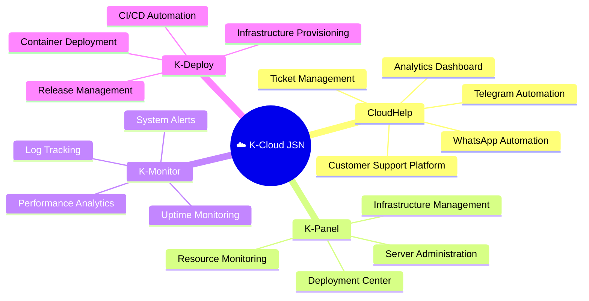
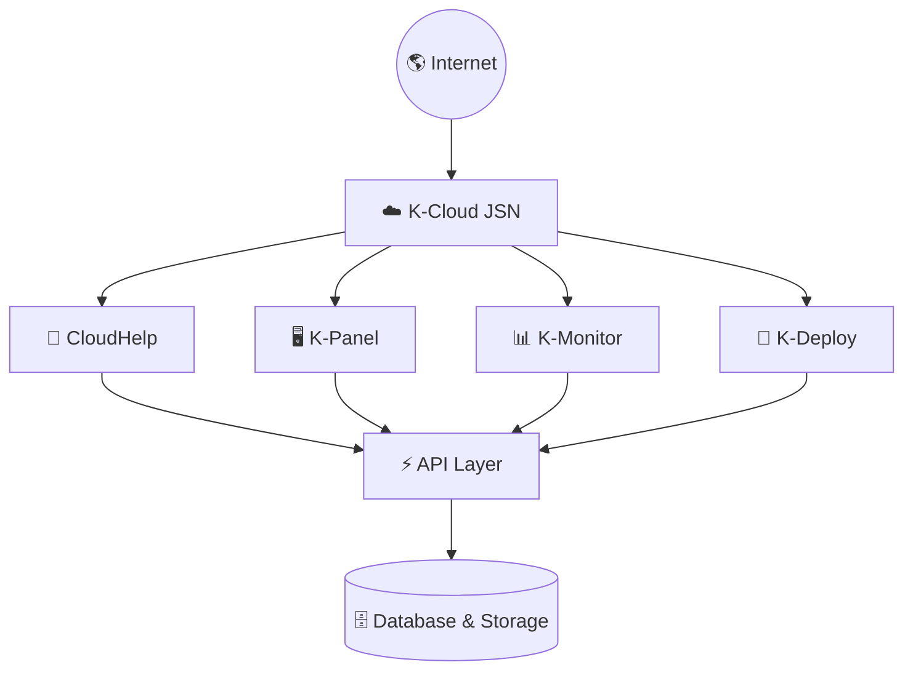
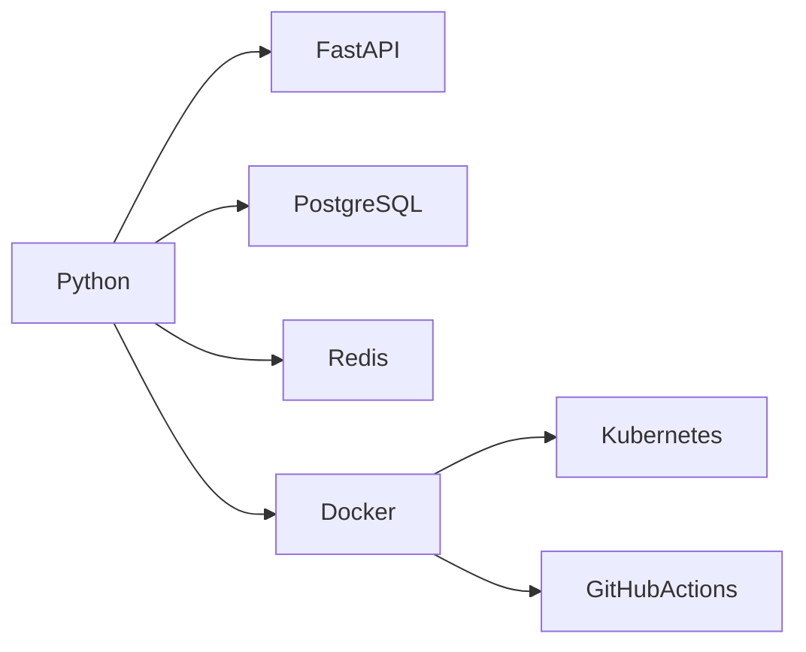
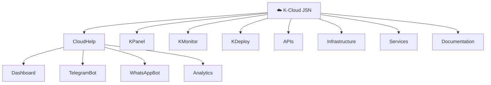
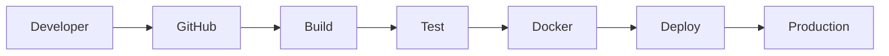
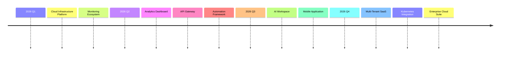
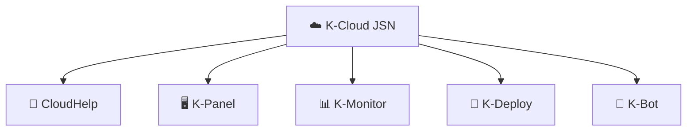

# ☁️ K-Cloud JSN

### Cloud • Automation • Innovation

---

# 🌐 Ecosystem

---

# 🏗 Architecture

---

# ⚡ Technology Stack

---

# 📂 Project Structure

---

# 🚀 CI/CD Pipeline

---

# 📈 GitHub Statistics

---

# 📊 Contribution Graph

---

# 🐍 Contribution Snake

---

# 🎯 Roadmap

---

# 🌎 Products

---

## Building Digital Solutions for Tomorrow 🚀

